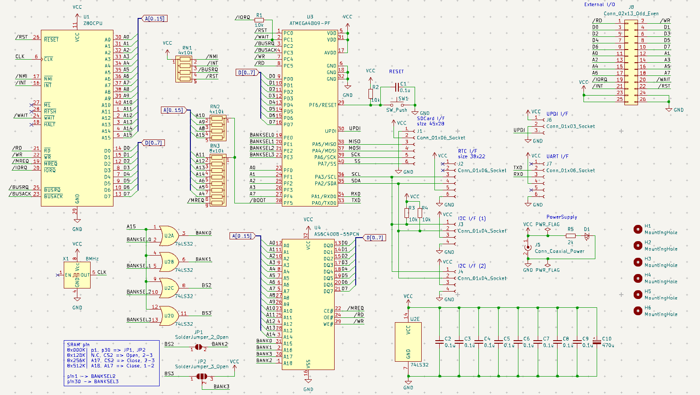
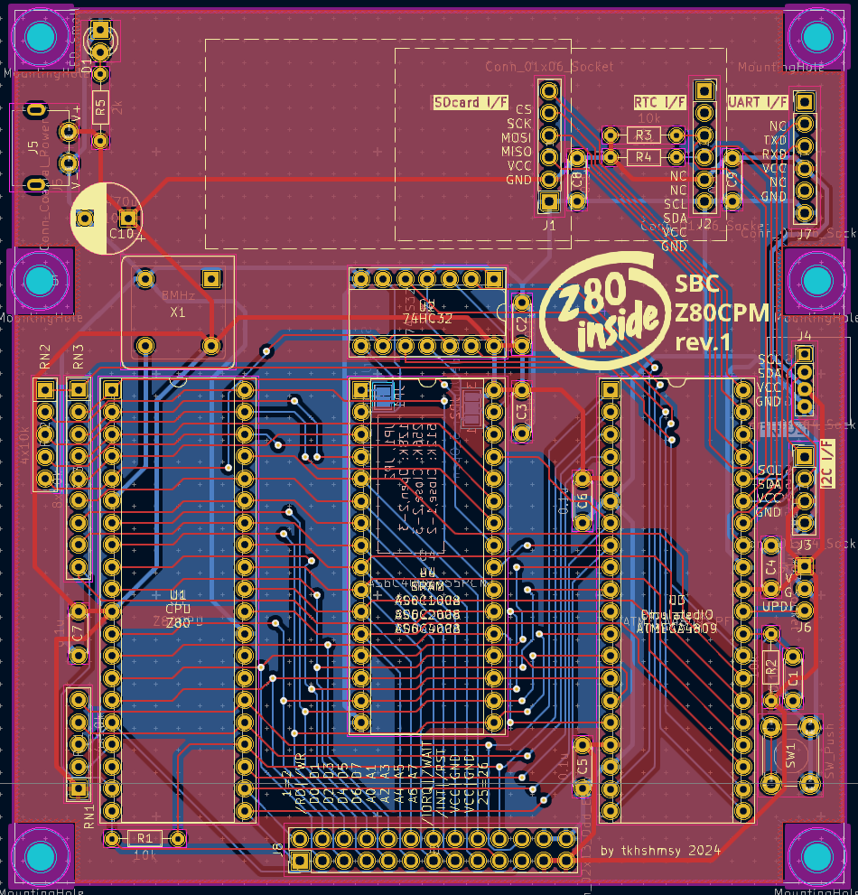

# sbcz80cpm
Single Board Computer with Z80 for CP/M

# Features
* Z80 cpu board for CP/M, without any ROM chips
  * supports 128KB to 512KB of SRAM, banked in 32KB
* ATMEGA4809 as Emulated I/O sub system
  * Boot loader
  * UART for console Input/Output
  * Floppy Disk Emulation with SD Card via SPI
  * RTC via I2C
  * other I2C devices

# PCB
## Schematics and Layout

## BOM
| Ref | Name | Qty | Description | Package | Link |
| --- | ---- | --- | ----------- | ------- | ---- |
| U1 | Z80 | 1 | Z80 CPU | DIP40 | |
| U2 | 74HC32 | 1 | Quad OR | DIP14 | |
| U3 | ATMEGA4809 | 1 | ATMEGA4809 | PDIP40 | |
| U4 | AS6C4008 | 1 | SRAM | DIP32 | |
| X1 | 1-8MHz | 1 | Crystal OSC | DIP8 | |
| C1, C2, C3, C4, C5, C6, C7, C8, C9 | 0.1uF | 9 | | ||
| C10  | 470uF    | 1 | | ||
| R1, R2 | 10K | 2 | for pullup | ||
| R3, R4 | 10K | 2 | for I2C pullup | ||
| R5 | 1K | 1 | for LED | ||
| RN1 | 10Kx4 | 1 | for pullup | ||
| RN2 | 10Kx4 | 1 | for IPL control | ||
| RN3 | 10Kx8 | 1 | for IPL control | ||
| D1 | LED | 1 | 3mm | ||
| SW1 | Push Button | 1 | Reset SW| ||
| J1, J2 | 1x6 Pin Socket | 2 | for SDCard, RTC | ||
| J3 | 1x4 Pin Socket | 1 | for I2C | pitch 2.54 ||
| J4 | 1x4 Pin Socket | 1 | for I2C | pitch 2.0 ||
| J5 | USB Type-C Power | 1 | for PowerSupply | ||
| J6 | 1x3 Pin Socket | 1 | for UPDI | ||
| J7 | 1x6 Pin Header | 1 | for Serial comm | ||
| J8 | 2x13 Pin Header | 1 | for I/O Bus export | ||

## Memory Map

### System Memory
| Address | Size | Name | Note |
| ----- | ---- | ---- | ---- |
|0x0000 - 0x7FFF| 32KB | RAM | Banked memory selected with BANKSEL0-3 |
|0x8000 - 0xFFFF| 32KB | RAM | Fixed to "the tail of Banks" |

### SRAM Banks
* every 32KB, selected with BANKSEL0-3
  * Bank0 : 0x0000 - 0x7FFF
  * ...
* "the tail of Banks" which is mapped into 0x8000 - 0xFFFF on system
  * 128KB: 0x18000 - 0x1FFFF
  * 256KB: 0x28000 - 0x2FFFF
  * 512KB: 0x48000 - 0x4FFFF

# License
* MIT
  * only for PCB
  * firmwares are NOT included.

# Author
* [tkhshmsy@gmail.com](tkhshmsy@gmail.com)