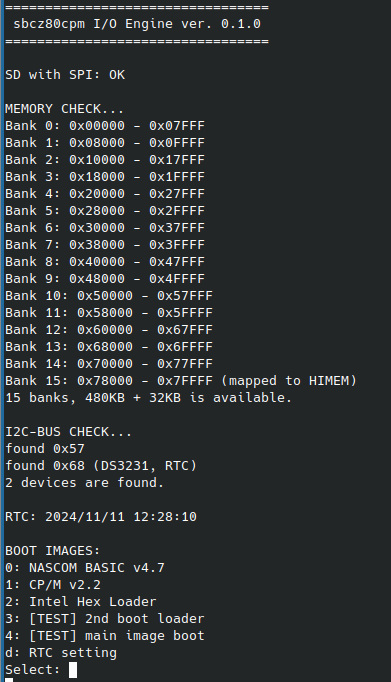

# I/O Engine for sbcz80cpm

the I/O device for sbcz80cpm powered by [ATMEGA4809](https://www.microchip.com/en-us/product/atmega4809).



## Features
* Boot control
  * provides IPL for no ROM / full RAM system
* I/O control, mostly for CP/M
  * Console I/O which is connected to host via UART
  * Disk I/O
  * RTC
  * communicate with I2C devices

## Requirements
* [platformio](https://platformio.org/)
  * cross development platform for embedded systems
* [pymcuprog](https://github.com/microchip-pic-avr-tools/pymcuprog)
  * serial to UPDI programmer for AVR

## Build
use platformio.
* modify `platformio.ini` if it needs

```bash
## only once, write the fuse to enable H/W RESET.
$ pio run -t fuses

## compile
$ pio run

## compile and upload
$ pio run -t upload
```

References,
* [PlatformIO Community/Hardware reset on AVR 4809](https://community.platformio.org/t/hardware-reset-on-avr-4809/24219)

## Design

### Connections
* for devices
  * UART
    * for host communication, 115200bps 8N1
  * I2C
    * RTC
    * other i2c devices
  * SPI
    * SD card, formatted VFAT/FAT32 
* for _Z80_
  * /WAIT, /IOREQ
  * /WR
  * /RD
  * AddressBus
  * DataBus
  * /MREQ

### Boot sequence and IPL
_sbcz80cpm_ is all RAM system, and has no ROM. Therefore, the IPL should be written into RAM by any way.
For this, at booting, _I/O Engine_ turns _Z80_ into bus master and writes IPL to the top of RAM.
However, as the _I/O Engine_(ATMEGA4809) has not enough I/O ports for address bus, the IPL needs to execute within a limited address space.

1. reset _Z80_
2. Loading _IPL_ (`/boot1st.bin`)
   1. assert /BUSREQ = 0
   2. wait until /BUSACK = 0 to enter BusMaster
   3. assert /BOOT = 0
      1. A15-8,A6-4 is 0
      2. /MREQ is 0 (SRAM is activated)
   4. assert A7 = 0
   5. using /WR, A0-3, write IPL from 0x0000 to 0x000F
   6. release /BOOT = 1
   7. release /BUSREQ = 1 to leave BusMaster
3. reset _Z80_, start _IPL_ from 0x0000
4. (_I/O Engine_ starts main loop)
5. _IPL_ (`/boot1st.bin`) is executed
   1. write 0x02 to I/O port 0x8F to prepare the binary of '2nd boot loader'
   2. read 256 times from I/O port 0x8F
      1. I/O Engine returns binary of _2nd boot loader_
   3. write each bytes from 0xFF00 to 0xFFFF.
   4. jump to 0xFF00
6. _2nd boot loader_ (e.g. `/boot2nd.bin`) is executed
   1. write 0x03 to I/O port 0x8F to prepare the binary of 'main image'
   2. read 32768 times from I/O port 0x8F
      1. I/O Engine returns binary of _main image_
   3. write each bytes from 0x0000 to 0x7FFF.
   4. jump to 0x0000

At here, the _IPL_ (boot1st.bin) has to be less than 16 bytes of code. Which is quite possible with the extra instructions of _Z80_.
Similarly, the _2nd Boot Loader_ has also to be less than 256 bytes of code, but for the _Z80_, 256 bytes is enough space to perform various operations.

### I/O sequence
The _I/O Engine_ needs to respond to IN/OUT instructions of _Z80_.
However, even though the _I/O Engine_ is running at 20MHz, it is still too slow to respond to the _Z80_ without WAIT.

So, it is solved this in the same way as other similar projects (e.g. [Z80MBC2](https://github.com/SuperFabius/Z80-MBC2), [Z80MBC3](https://github.com/eprive/Z80-MBC3)).

1. _I/O Engine_ waits until /WAIT = 0
   1. _Z80_ executes the instruction 'OUT'or 'IN', so assert /IOREQ = 0
   2. because /IOREQ connected to /WAIT with resistor, it turns /WAIT = 0
   3. IN/OUT command-cycle is 'T1, T2, TW, T3', _Z80_ waits until /WAIT =1.
      1. refer to [Z80 CPU User Manual](https://www.zilog.com/docs/z80/um0080.pdf) page 11
      2. in TW cycle, /RD,/WR, Address and Data is already asserted.
2. _I/O Engine_ reads /WR, /RD, Address and Data buses to execute it's API.
   1. /WR = 0 is asserted, it is a 'write' operation. _I/O Engine_ reads from Data bus.
   2. /RD = 0 is asserted, it is a 'read' operation. _I/O Engine_ changes Data bus to output, and outputs the data.
3. _I/O Engine_ releases bus,
   1. asserts /BUSREQ = 0
   2. asserts /WAIT = 1 as output port (at here, still /IOREQ = 0 yet)
      1. _Z80_ start to continues executing the T3 cycle and the next instruction.
      2. But because /BUSREQ = 0, _Z80_ waits at the head of T1 in M1 cycle of the next instruction.
         1.  refer to [Z80 CPU User Manual](https://www.zilog.com/docs/z80/um0080.pdf) page 12
         2. _Z80_ does not touch its buses yet and waits until /BUSACK = 0.
   3. release Data bus = High-Z as input port if the case that _I/O Engine_ was output any data.
   4. release /WAIT = High-Z as input port.
   5. asserts /BUSREQ = 1 to release all buses and wake up _Z80_.
4. _Z80_ continues to next cycle...

## Boot configuration
At booting, _I/O Engine_ read `/boot.cfg` from SD card.
`boot.cfg` is written in the TSV (Tab Separated Value) format and contains the following items.

* (1) the title of the setting
  * e.g. `CP/M 2.2`
* (2) the full-path of 2nd boot loader. 
  * Normally `/boot2nd.bin` is used, but a modified one is able to use.
  * e.g. `/cpm22/cpm22ipl.bin`
* (3) the full-path of main image
  * e.g. `/cpm22/bios.bin`
* (4) the prefix of the disk-image-files
  * e.g. `/cpm22`

The _prefix_ in the 4th item is used for creating _the image-filename_ of _the floppy-disk-emulation_ and is expanded as follows:
* `prefix` + `/disk` + \<disk no.\> + `.img`


## API as I/O device
Mainly for CP/M, the _I/O Engine_ provides API centered around FloppyDisk emulation.
It is placed under 8-bit addresses as a _Z80_'s I/O device.

About floppy-disk emulation, the default setting is _ibm-3740 format_ as follows:
* tracks per disk: 77 (allows 0-76)
* sectors per track: 26 (allows 0-25)
* sector length: 128 bytes

### for READ
| Address | Function | Description |
|---------|----------|-------------|
| 0x80    | UARTST   | return the status of UART |
| 0x81    | UART     | receive from UART |
| 0x82    | SELDSK   | return the number of current disk |
| 0x83    | SETTRK   | return the number of current track |
| 0x84    | SETSEC   | return the number of current sector |
| 0x85    | DISKIO   | read the current sector, must to read sector length continuously |
| 0x86    | ----     | Not Implemented yet |
| 0x87    | ----     | Not Implemented yet |
| 0x88    | ----     | Not Implemented yet |
| 0x89    | (UPTIME) | Not Implemented yet |
| 0x8A    | RTC      | read RTC |
| 0x8B    | I2CTRANS | return the result of transmit() of i2c |
| 0x8C    | I2CREQ   | return the result of available() of i2c |
| 0x8D    | I2CDATA  | read from i2c |
| 0x8E    | BANK     | return the current bank of SRAM |
| 0x8F    | MISC     | return the binary data for IPL |

#### UARTST
| bit | Description |
|-----|-------------|
| 7-2 | Not used |
| 1   | Tx condition, 1: able to transmit, 0: busy |
| 0   | Rx condition, 1: able to receive, 0: no char |

### for WRITE
| Address | Function | Description |
|---------|----------|-------------|
| 0x80    | UARTST   | No response |
| 0x81    | UART     | transmit to UART |
| 0x82    | SELDSK   | select the current disk |
| 0x83    | SETTRK   | set the current track |
| 0x84    | SETSEC   | set the current sector |
| 0x85    | DISKIO   | write the current sector, must to write sector length continuously |
| 0x86    | ----     | Not Implemented yet |
| 0x87    | ----     | Not Implemented yet |
| 0x88    | ----     | Not Implemented yet |
| 0x89    | (UPTIME) | Not Implemented yet |
| 0x8A    | RTC      | write RTC |
| 0x8B    | I2CTRANS | send transmit() to i2c |
| 0x8C    | I2CREQ   | send request() to i2c |
| 0x8D    | I2CDATA  | write into i2c |
| 0x8E    | BANK     | set the current bank of SRAM |
| 0x8F    | MISC | input |

#### MISC input
| value | description |
|-------|-------------|
| 0x00  | set the dummy data 0x00 |
| 0x01  | set the binary of fixed _1st boot loader_ |
| 0x02  | set the binary of selected _2nd boot loader_ |
| 0x03  | set the binary of selected _main image_ |
| 0xFF  | reset _Z80_ |

## References
* Zilog
  * [Z80 CPU User Manual](https://www.zilog.com/docs/z80/um0080.pdf)
* Microchip ATMEGA4809
  * [ATMEGA4809](https://www.microchip.com/en-us/product/atmega4809)
  * [Datasheet](https://ww1.microchip.com/downloads/aemDocuments/documents/MCU08/ProductDocuments/DataSheets/ATmega4808-09-DataSheet-DS40002173C.pdf)
* Other Projects
  * [Z80MBC2](https://github.com/SuperFabius/Z80-MBC2)
  * [Z80MBC3](https://github.com/eprive/Z80-MBC3)

## License
* MIT

## Author
* [tkhshmsy@gmail.com](tkhshmsy@gmail.com)
